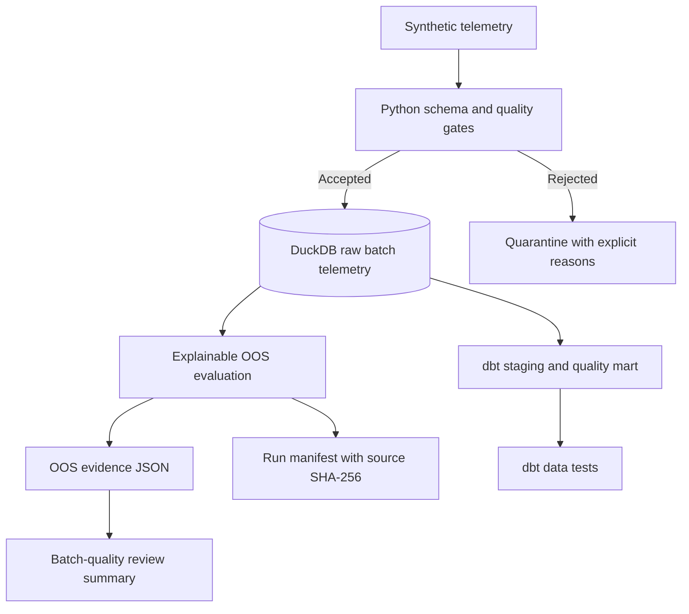
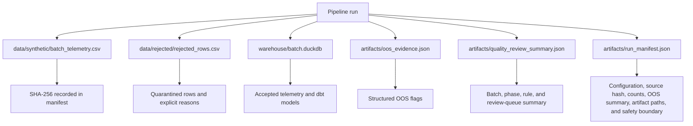
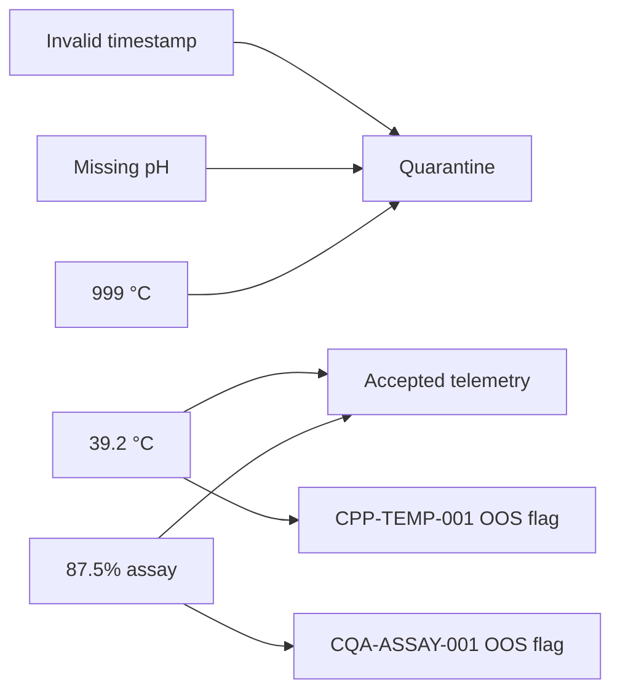
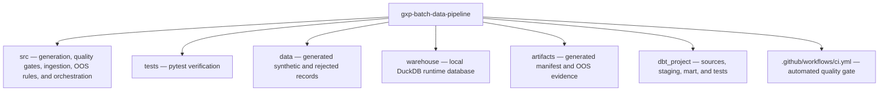

# GxP Batch Manufacturing Data Pipeline

<div align="center">

[](https://github.com/alianisreyesr/gxp-batch-data-pipeline/actions/workflows/ci.yml)
[](https://github.com/alianisreyesr/gxp-batch-data-pipeline/actions/workflows/codeql.yml)
[](https://www.python.org/)
[](https://duckdb.org/)
[](https://www.getdbt.com/)
[]()
[]()
[](LICENSE)

**GxP · Batch Data Pipeline · DuckDB · dbt · ALCOA+**

*Portfolio-safe pharmaceutical batch manufacturing data pipeline — synthetic data only.*

[Run evidence](#run-evidence) · [Evidence verification](#evidence-verification) · [One-command pipeline](#one-command-pipeline) · [Case study](docs/CASE_STUDY.md) · [Data contract](docs/DATA_CONTRACT.md) · [Controls](#implemented-controls) · [Contributing](CONTRIBUTING.md) · [Security](SECURITY.md)

</div>

---

> **Portfolio safety boundary:** all records, telemetry, identifiers, thresholds, and scenarios in this repository are fictional and synthetically generated. This is educational portfolio software, not validated GxP software, and it must not be used for manufacturing, release, quality, or patient-safety decisions.

## What this implements

A traceable batch-data pipeline that produces durable run evidence from deterministic synthetic process telemetry:



The implementation intentionally favors traceability and executable evidence over platform complexity.

## Verified CI evidence

The GitHub Actions workflow completed successfully with:

- **12 Python tests passed**
- **80.25% Python statement coverage** with an **80% CI gate**
- **96 synthetic telemetry rows generated**
- **96 accepted / 0 rejected** for the deterministic default dataset
- **2 explainable OOS flags**: one `CPP-TEMP-001` and one `CQA-ASSAY-001`
- **2 dbt models + 8 dbt data tests**, all successful
- Machine-readable run manifest with source SHA-256, deterministic run ID, configuration, counts, OOS summary, artifact paths, and safety boundary

For the verified default run, the source CSV SHA-256 was:

```text
b84c6c743b86d018c9ce02d2648049924fee7e607d0f29906c5408d77416cb03
```

and the deterministic run ID was:

```text
run-b84c6c743b86d018
```

## One-command pipeline

After installing dependencies, the canonical execution path is:

```bash
python -m src.pipeline --seed 42
```

This command generates the synthetic source data, validates and quarantines records, loads accepted telemetry into DuckDB, evaluates OOS rules, persists OOS evidence, and writes the run manifest.

To run the analytical transformation layer afterward:

```bash
dbt build --project-dir dbt_project --profiles-dir dbt_project
```

## Evidence verification

After the pipeline generates its local runtime artifacts, verify that the manifest, source hash, evidence files, and OOS count agree:

```bash
python -m src.verify_evidence
```

The verifier exits non-zero if an expected evidence artifact is missing, a referenced path leaves the selected run root, the source CSV no longer matches the manifest SHA-256, the deterministic run ID is inconsistent, or the OOS evidence count differs from the manifest. It verifies evidence integrity; it does not represent a regulated review, release decision, or validation record.


## Run evidence

The pipeline writes runtime evidence under ignored local paths:



The run ID is derived from the source CSV hash. The repository does **not** claim the DuckDB file itself is cryptographically reproducible.

## Implemented controls

- Deterministic synthetic telemetry generation with seed support
- Required-field, type, UTC timestamp, duplicate-key, monotonicity, and plausible-range validation
- Explicit quarantine of rejected records with machine-readable reasons
- DuckDB persistence for accepted telemetry
- Rule-based OOS flags with rule ID, observed value, expected range, batch, phase, and timestamp
- Structured OOS JSON evidence
- Machine-readable quality-review summary grouped by batch, phase, and rule
- Source CSV SHA-256 evidence and deterministic run ID
- Versioned run-manifest schema
- dbt staging and batch-quality mart models
- 12-test Python suite with measured statement coverage
- GitHub Actions gate using least-privilege `contents: read` permissions
- Deterministic manifest assertions followed by `dbt build`

## Quality gate vs. OOS rule

The quality gate decides whether a record is structurally trustworthy enough to enter the analytical pipeline. OOS rules are narrower process-review rules. A record can therefore be **valid telemetry but still OOS**, keeping data-integrity validation separate from quality interpretation.

Examples:



## Synthetic schema

| Field | Meaning |
|---|---|
| `batch_id` | Fictional batch identifier |
| `timestamp_utc` | Explicit UTC telemetry timestamp |
| `phase` | Synthetic process phase |
| `bioreactor_id` | Fictional equipment identifier |
| `temperature_c` | Synthetic process temperature |
| `ph` | Synthetic pH value |
| `dissolved_oxygen_pct` | Synthetic dissolved oxygen percentage |
| `agitation_rpm` | Synthetic agitation rate |
| `assay_pct` | Synthetic assay/CQA result |

## Repository structure



## Scope & production path

This portfolio artifact demonstrates one concise engineering story:

**synthetic telemetry → explicit data-quality decisions → traceable source evidence → reproducible analytical run metadata → tested transformations → explainable quality signals**.

A production implementation would additionally require authentication, electronic signatures, governed deployment, validated infrastructure, formal CSV deliverables, and production data connectors — each a well-defined engineering problem, not a gap in this prototype’s intent.

---

## Regulated Portfolio Ecosystem

| Project | Domain Focus | Status |
|---|---|---|
| **[Quality Deviation Risk Monitor](https://github.com/alianisreyesr/quality-deviation-risk-monitor)** | Deviation prioritization & explainable risk scoring | ✅ Active · 57 tests |
| **[CSV Evidence Tracker](https://github.com/alianisreyesr/csv-evidence-tracker)** | Requirements traceability, IQ/OQ/PQ test execution, audit trail | ✅ Active · 27 tests |
| **[Data Integrity Case File](https://github.com/alianisreyesr/data-integrity-case-file)** | ALCOA+ investigation, CAPA readiness, local AI triage | ✅ Active |
| **[GxP Change Control](https://github.com/alianisreyesr/gxp-change-control)** | Controlled change lifecycle & approvals | ✅ Active · 68 tests |
| **[CSA Assurance Planner](https://github.com/alianisreyesr/csa-assurance-planner)** | Risk-based software assurance planning, FDA CSA alignment | ✅ Active |

---

<div align="center">

**Built by [Alianis Reyes-Reyes](https://www.linkedin.com/in/alianis-reyes-reyes/)**

Information Systems @ UPRM · Eli Lilly Tech@Lilly Alumni

*Traceability is not a feature — it’s the foundation.*

</div>
